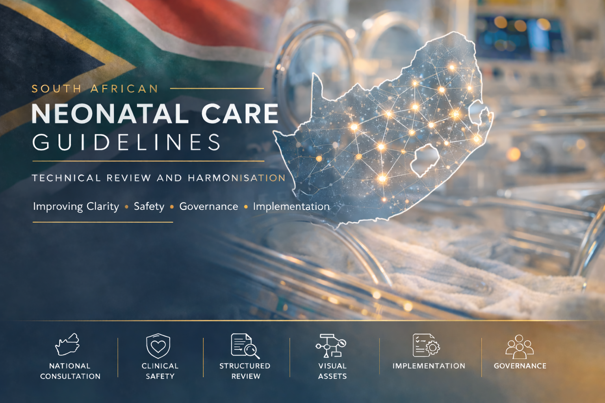

  

<h2 align="center">Technical Review and Editorial Harmonisation</h2>

Shakti Pillay 
Neonatologist 
University of Cape Town

Review Period: 2025 – Current

---
## Technical Review Documentation

The structured technical review of draft guideline chapters is documented here:

- **[View the Review Documentation](reviews/)**
- **[View the Reviewer Comment Collation](Reviewer-comment-collation/README.md)**

The reviewer comment collation contains the actual comments extracted from the draft guideline document, grouped chapter by chapter, with reviewer/source, anchor text and review themes retained where available.

This documents the process of collating national consultation feedback and using it to guide chapter-level technical review, editorial harmonisation, clinical safety review, formatting refinement and implementation planning.
