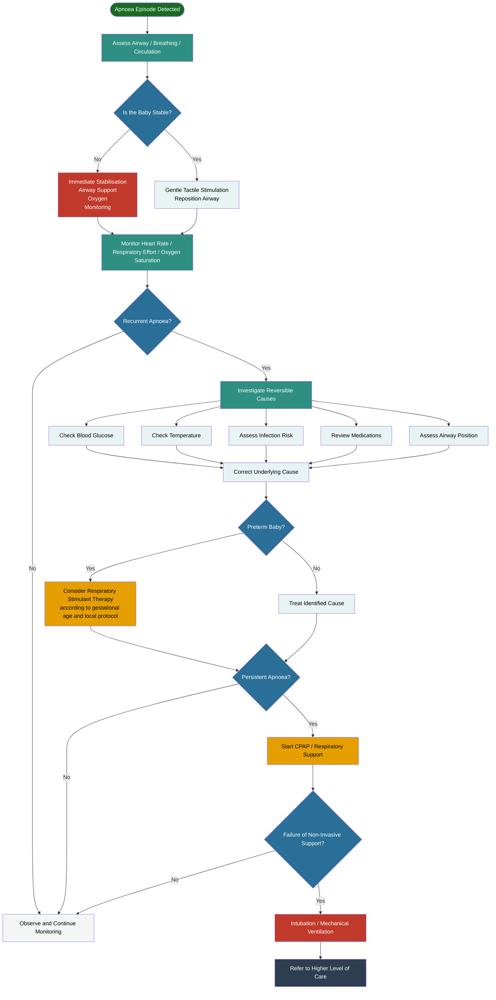

```mermaid
flowchart TB

A([Apnoea Episode Detected]):::start
A --> B["Assess Airway / Breathing / Circulation"]:::assessment

B --> C{"Is the Baby Stable?"}:::decision

C -->|No| D["Immediate Stabilisation
Airway Support
Oxygen
Monitoring"]:::urgent
C -->|Yes| E["Gentle Tactile Stimulation
Reposition Airway"]:::action

D --> F
E --> F

F["Monitor Heart Rate / Respiratory Effort / Oxygen Saturation"]:::assessment

F --> G{"Recurrent Apnoea?"}:::decision

G -->|No| H["Observe and Continue Monitoring"]:::observe
G -->|Yes| I["Investigate Reversible Causes"]:::assessment

I --> J["Check Blood Glucose"]:::action
I --> K["Check Temperature"]:::action
I --> L["Assess Infection Risk"]:::action
I --> M["Review Medications"]:::action
I --> N["Assess Airway Position"]:::action

J --> O
K --> O
L --> O
M --> O
N --> O

O["Correct Underlying Cause"]:::action

O --> P{"Preterm Baby?"}:::decision

P -->|Yes| Q["Consider Respiratory Stimulant Therapy
according to gestational age and local protocol"]:::treatment
P -->|No| R["Treat Identified Cause"]:::action

Q --> S
R --> S

S{"Persistent Apnoea?"}:::decision

S -->|No| H
S -->|Yes| T["Start CPAP / Respiratory Support"]:::treatment

T --> U{"Failure of Non-Invasive Support?"}:::decision

U -->|No| H
U -->|Yes| V["Intubation / Mechanical Ventilation"]:::urgent

V --> W["Refer to Higher Level of Care"]:::refer

classDef start fill:#196B24,color:#ffffff
classDef assessment fill:#2F8F83,color:#ffffff
classDef decision fill:#2A6F97,color:#ffffff
classDef action fill:#E8F4F3,color:#000000
classDef treatment fill:#E69F00,color:#000000
classDef urgent fill:#C0392B,color:#ffffff
classDef observe fill:#F4F6F6,color:#000000
classDef refer fill:#2C3E50,color:#ffffff
```
classDef observe fill:#F4F6F6,color:#000000,stroke-width:0
classDef refer fill:#2C3E50,color:#ffffff,stroke-width:0
