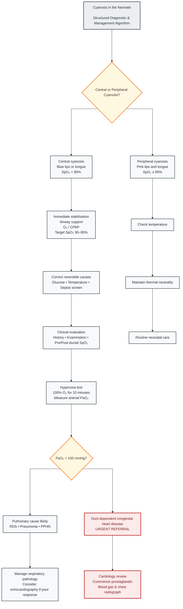

## Cyanosis in the Neonate

```mermaid
%%{init: {"flowchart": {"curve": "stepAfter", "nodeSpacing": 120, "rankSpacing": 150}}}%%
flowchart TB

TITLE["Cyanosis in the Neonate<br/><br/>Structured Diagnostic & Management Algorithm"]

TITLE --> DECISION1{"Central or Peripheral Cyanosis?"}

%% CENTRAL PATHWAY
DECISION1 --> CENTRAL
CENTRAL["Central cyanosis<br/>Blue lips or tongue<br/>SpO₂ < 95%"]

CENTRAL --> STAB["Immediate stabilisation<br/>Airway support<br/>O₂ / CPAP<br/>Target SpO₂ 90–95%"]

STAB --> REVERSIBLE["Correct reversible causes<br/>Glucose • Temperature • Sepsis screen"]

REVERSIBLE --> EVAL["Clinical evaluation<br/>History • Examination • Pre/Post-ductal SpO₂"]

EVAL --> HYP["Hyperoxia test<br/>100% O₂ for 10 minutes<br/>Measure arterial PaO₂"]

HYP --> DECISION2{"PaO₂ > 150 mmHg?"}

DECISION2 --> PULMONARY
DECISION2 --> CARDIAC

PULMONARY["Pulmonary cause likely<br/>RDS • Pneumonia • PPHN"]

CARDIAC["Duct-dependent congenital heart disease<br/>URGENT REFERRAL"]

PULMONARY --> RESP_MANAGE["Manage respiratory pathology<br/>Consider echocardiography if poor response"]

CARDIAC --> CARD_MANAGE["Cardiology review<br/>Commence prostaglandin<br/>Blood gas & chest radiograph"]

%% PERIPHERAL PATHWAY
DECISION1 --> PERIPHERAL
PERIPHERAL["Peripheral cyanosis<br/>Pink lips and tongue<br/>SpO₂ ≥ 95%"]

PERIPHERAL --> TEMP["Check temperature"]
TEMP --> WARM["Maintain thermal neutrality"]
WARM --> ROUTINE["Routine neonatal care"]

%% STYLING
classDef title fill:#ECEFF1,stroke:#263238,stroke-width:2px,color:#263238;
classDef process fill:#F7F9FA,stroke:#37474F,stroke-width:1.8px,color:#263238;
classDef decision fill:#FFF8E1,stroke:#EF6C00,stroke-width:2px,color:#4E342E;
classDef urgent fill:#FDEAEA,stroke:#B71C1C,stroke-width:2.4px,color:#7A1C1C;

class TITLE title;
class DECISION1,DECISION2 decision;
class CENTRAL,STAB,REVERSIBLE,EVAL,HYP,PULMONARY,RESP_MANAGE,PERIPHERAL,TEMP,WARM,ROUTINE process;
class CARDIAC,CARD_MANAGE urgent;
```
