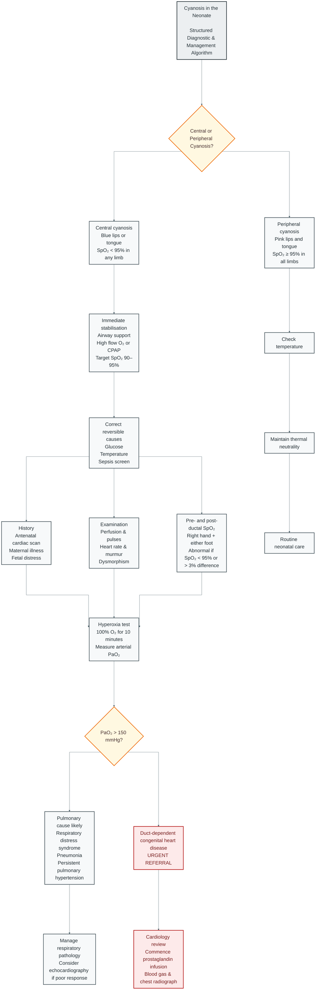

```mermaid
%%{init: {
  "flowchart": {
    "curve": "stepAfter",
    "nodeSpacing": 200,
    "rankSpacing": 240
  },
  "themeVariables": {
    "fontFamily": "Source Sans 3",
    "fontSize": "26px",
    "primaryTextColor": "#263238",
    "lineColor": "#455A64"
  }
}}%%
flowchart TB

TITLE["Cyanosis in the Neonate<br/><br/>Structured Diagnostic & Management Algorithm"]

TITLE --> DECISION1{"Central or Peripheral Cyanosis?"}

%% CENTRAL PATH
DECISION1 --> CENTRAL
CENTRAL["Central cyanosis<br/>Blue lips or tongue<br/>SpO₂ < 95% in any limb"]

CENTRAL --> STAB["Immediate stabilisation<br/>Airway support<br/>High flow O₂ or CPAP<br/>Target SpO₂ 90–95%"]

STAB --> REVERSIBLE["Correct reversible causes<br/>Glucose<br/>Temperature<br/>Sepsis screen"]

REVERSIBLE --> HX["History<br/>Antenatal cardiac scan<br/>Maternal illness<br/>Fetal distress"]

REVERSIBLE --> EXAM["Examination<br/>Perfusion & pulses<br/>Heart rate & murmur<br/>Dysmorphism"]

REVERSIBLE --> SPO2["Pre- and post-ductal SpO₂<br/>Right hand + either foot<br/>Abnormal if SpO₂ < 95% or > 3% difference"]

HX --> HYP
EXAM --> HYP
SPO2 --> HYP

HYP["Hyperoxia test<br/>100% O₂ for 10 minutes<br/>Measure arterial PaO₂"]

HYP --> DECISION2{"PaO₂ > 150 mmHg?"}

DECISION2 --> PULMONARY
DECISION2 --> CARDIAC

PULMONARY["Pulmonary cause likely<br/>Respiratory distress syndrome<br/>Pneumonia<br/>Persistent pulmonary hypertension"]

CARDIAC["Duct-dependent congenital heart disease<br/>URGENT REFERRAL"]

PULMONARY --> RESP_MANAGE["Manage respiratory pathology<br/>Consider echocardiography if poor response"]

CARDIAC --> CARD_MANAGE["Cardiology review<br/>Commence prostaglandin infusion<br/>Blood gas & chest radiograph"]

%% PERIPHERAL PATH
DECISION1 --> PERIPHERAL
PERIPHERAL["Peripheral cyanosis<br/>Pink lips and tongue<br/>SpO₂ ≥ 95% in all limbs"]

PERIPHERAL --> TEMP["Check temperature"]
TEMP --> WARM["Maintain thermal neutrality"]
WARM --> ROUTINE["Routine neonatal care"]

%% STYLING
classDef title fill:#ECEFF1,stroke:#263238,stroke-width:3px,color:#263238;
classDef process fill:#F7F9FA,stroke:#37474F,stroke-width:2.5px,color:#263238;
classDef decision fill:#FFF8E1,stroke:#EF6C00,stroke-width:3px,color:#4E342E;
classDef urgent fill:#FDEAEA,stroke:#B71C1C,stroke-width:3px,color:#7A1C1C;

class TITLE title;
class DECISION1,DECISION2 decision;
class CENTRAL,STAB,REVERSIBLE,HX,EXAM,SPO2,HYP,PULMONARY,RESP_MANAGE,PERIPHERAL,TEMP,WARM,ROUTINE process;
class CARDIAC,CARD_MANAGE urgent;
```
