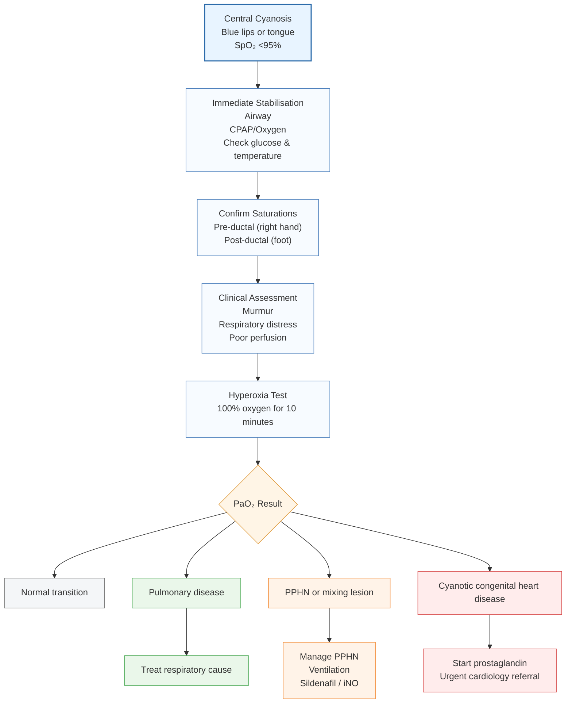

# Algorithm: Evaluation of Central Cyanosis in the Newborn

```mermaid
flowchart TB

A["Central Cyanosis<br>Blue lips or tongue<br>SpO₂ <95%"]:::start

B["Immediate Stabilisation<br>Airway<br>CPAP/Oxygen<br>Check glucose & temperature"]:::process

C["Confirm Saturations<br>Pre-ductal (right hand)<br>Post-ductal (foot)"]:::process

D["Clinical Assessment<br>Murmur<br>Respiratory distress<br>Poor perfusion"]:::process

E["Hyperoxia Test<br>100% oxygen for 10 minutes"]:::process

F{"PaO₂ Result"}:::decision

G["Normal transition"]:::normal
H["Pulmonary disease"]:::lung
I["PPHN or mixing lesion"]:::pphn
J["Cyanotic congenital heart disease"]:::chd

K["Treat respiratory cause"]:::lung
L["Manage PPHN<br>Ventilation<br>Sildenafil / iNO"]:::pphn
M["Start prostaglandin<br>Urgent cardiology referral"]:::chd

A --> B --> C --> D --> E --> F
F --> G
F --> H --> K
F --> I --> L
F --> J --> M

classDef start fill:#E8F4FF,stroke:#2C6BAA,stroke-width:2px
classDef process fill:#F7FBFF,stroke:#4A7EBB
classDef decision fill:#FFF5E6,stroke:#E09B3D
classDef lung fill:#EAF7EA,stroke:#4DAA57
classDef pphn fill:#FFF3E8,stroke:#F28C38
classDef chd fill:#FFECEC,stroke:#D64545
classDef normal fill:#F4F6F8,stroke:#7A7A7A
```
